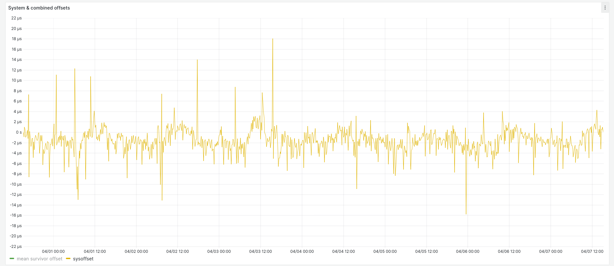
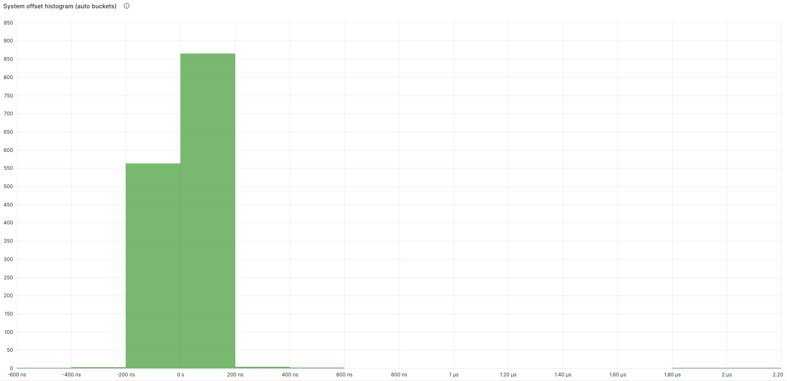
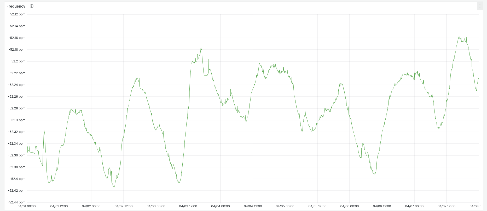

# NTPmon

## Introduction

NTPmon is a program which is designed to report on essential health metrics for
NTP.  It provides a Nagios check which can be used with many alerting systems,
including support for Nagios performance data.  NTPmon can also run as a daemon
for sending metrics to collectd, prometheus, or telegraf.  It supports both
`ntpd` and `chronyd`.

NTPmon is designed to encourage the use of robust NTP configurations.  The
defaults for what is considered healthy and non-healthy are roughly based on
[RFC8633: NTP Best Current
Practices](https://datatracker.ietf.org/doc/html/rfc8633).

## Copyright

Copyright (c) 2015-2024 Paul D. Gear <https://libertysys.com.au/>

## License

This program is free software: you can redistribute it and/or modify it under
the terms of the GNU Affero General Public License as published by the Free
Software Foundation, either version 3 of the License, or (at your option) any
later version.

This program is distributed in the hope that it will be useful, but WITHOUT ANY
WARRANTY; without even the implied warranty of MERCHANTABILITY or FITNESS FOR A
PARTICULAR PURPOSE.  See the GNU Affero General Public License for more details.

You should have received a copy of the GNU Affero General Public License along
with this program.  If not, see <https://www.gnu.org/licenses/agpl.html>.

## Gallery

Here are some graphs produced with data gathered by NTPmon using telegraf,
InfluxDB, and Grafana.

A system offset graph:

A system offset histogram:

A root dispersion graph:

A frequency error graph showing variation based on temperature due to time of day:

Or you could try these interactive Grafana dashboard snapshots:
- https://snapshots.raintank.io/dashboard/snapshot/QV6YTE7nuInMuThGEBtViPLWNoAZqTYs
- https://snapshots.raintank.io/dashboard/snapshot/V8lcRJEY1jhHe1h8EqQSEalkzEW9WG0O
- https://snapshots.raintank.io/dashboard/snapshot/xHdgapqImIxKOH36x9dk2rkA6UjPYrwg
- https://snapshots.raintank.io/dashboard/snapshot/FrJ0HQJ6lpBtfjezDHwbwKVauChd9TMN
- https://snapshots.raintank.io/dashboard/snapshot/jQUiLFkHKNKJJSJZLz6ZiYpaKA3X2EH4

You can find more context for these dashboards in the following blog posts:

- https://www.libertysys.com.au/2024/04/aws-microsecond-accurate-time-first-look/
- https://www.libertysys.com.au/2024/04/tlntc-time-infrastructure/
- https://www.libertysys.com.au/2024/04/vm-timekeeping-using-the-ptp-hardware-clock-on-kvm/

## Installation

On Ubuntu (and possibly other Debian derivatives) NTPmon and its prerequisites
can be installed from [its
PPA](https://launchpad.net/~paulgear/+archive/ubuntu/ntpmon/) using:

    sudo add-apt-repository ppa:paulgear/ntpmon
    sudo apt install chrony ntpmon

`chrony` is the preferred NTP server on Ubuntu; you can also use `ntp` or
`ntpsec` from the universe pool, although the are not guaranteed to receive
security updates unless you use Ubuntu Pro.

If you wish to use something other than the prometheus exporter by default, you
must edit `/etc/default/ntpmon` to configure the command-line options.  Run
`/opt/ntpmon/bin/ntpmon --help` for details of all available options.

## Prerequisites

NTPmon is written in python, and requires python 3.8 or later.  It uses modules
from the standard python library, and also requires the `psutil` library, which
is available from pypi or your operating system repositories. It requires `ntpq`
or `chronyc` to retrieve metrics from the running NTP daemon. If you intend to
run the prometheus exporter, the [prometheus python
client](https://pypi.org/project/prometheus-client/) is also required.

On Ubuntu (and probably other Debian-based Linux distributions), you can install
all the prerequisites by running:

    sudo apt-get install chrony python3-prometheus-client python3-psutil
    # or substitute ntp for the traditional NTP server

## Usage

To run NTPmon directly from source after manually installing the prerequisites:

    cd /opt
    git clone https://github.com/paulgear/ntpmon
    cd ntpmon
    ./src/ntpmon.py --help

## Metrics

NTPmon alerts on the following metrics of the local NTP server:

### Summary metrics

#### sync

Does NTP have a sync peer?  If not, return CRITICAL, otherwise return OK.

#### peers

Are there more than the minimum number of peers active?  The NTP algorithms
require a minimum of 3 peers for accurate clock management; to allow for failure
or maintenance of one peer at all times, NTPmon returns OK for [4 or more
configured peers](https://datatracker.ietf.org/doc/html/rfc8633#section-3.2),
CRITICAL for 1 or 0, and WARNING for 2-3.

#### reach

Are the configured peers reliably reachable on the network?  Return CRITICAL for
less than 50% total reachability of all configured peers; return OK for greater
than 75% total reachability of all configured peers.

#### offset

Is the clock offset from its sync peer (or other peers, if the sync peer is not
available) acceptable?  Return CRITICAL for 50 milliseconds or more average
difference, WARNING for 10 ms or more average difference, and OK for anything
less.

### System metrics

In addition, NTPmon retrieves the following metrics directly from the local NTP
server (using `ntpq -nc readvar` or `chronyc -c tracking`):

- offset (as `sysoffset`, to distinguish it from `offset`)
- sys_jitter (as `sysjitter`, for grouping with `sysoffset`)
- frequency
- stratum
- rootdelay
- rootdisp

See the [NTP documentation](http://doc.ntp.org/current-stable/ntpq.html#system)
for the meaning of these metrics.

### Peer metrics

Counts of each peer type are emitted under the `ntpmon_peers` metric.  The
recognised peer types are `pps`, `sync`, `invalid`, `false`, `excess`, `backup`,
`outlier`, `survivor`, and `unknown`.  (Under normal circumstances, `unknown`
will never appear - its presence indicates a bug in NTPmon.)  Note that `sync`
also includes the `pps` peer (if any), and `survivor` also includes the `sync`
peer (if any), so they are not strictly mutually exclusive.  There should be no
overlap in any of the other types.

If your `chronyd` or `ntpd` is configured to store peer (source) statistics,
these will be collected as they appear in the relevant log files
(`/var/log/chrony/measurements.log` and `/var/log/ntpstats/peerstats`,
respectively, by default) and emitted under the `ntpmon_peer` (singluar) metric,
in addition to all the above-mentioned metrics.  Use the `--logfile` command
line option to monitor a different file if your distribution uses different
locations.  NTPmon will silently ignore any issues relating to these files in
order to continue running, so if you don't notice metrics coming out when you
expect them, check permissions on the files and compare their contents to the
documented formats.  Please submit a bug report if you encounter persistent
issues with this.

`Collectd` doesn't have a really great way to support these individual peer
metrics, so each peer is considered to be a `collectd` "host".  This feature
should be considered experimental for `collectd`, and subject to change or
deprecation (input on this is welcome).

## Prometheus exporter

When run in prometheus mode, NTPmon uses the [prometheus python
client](https://pypi.python.org/pypi/prometheus_client) to expose metrics via
the HTTP server built into that library.  No security testing or validation has
been performed on this library by the NTPmon author; users are suggested not to
expose it on untrusted networks, and are reminded that - as stated in the
license terms - this software comes with no warranty.

## Telegraf integration

When run in telegraf mode, NTPmon requires the telegraf [socket
listener](https://docs.influxdata.com/telegraf/v1/plugins/#input-socket_listener)
input plugin to be enabled.  Use the `--connect` command-line option if you
configure this to listen on a host and/or port other than the default
(127.0.0.1:8094).

## Startup delay

By default, until the NTP server has been running for 512 seconds (the minimum
time for 8 polls at 64-second intervals), `check_ntpmon` will return OK (zero
return code). This is to prevent false positives on startup or for short-lived
VMs.  To ignore this safety precaution, use `--run-time` with a low number
(e.g. 1 sec).

## Roadmap

### Python version

The current minimum python version targeted is 3.8.  This version [reaches end
of life in October 2024](https://www.python.org/downloads/) and will be
deprecated in NTPmon sometime between [the release of Ubuntu
24.04](https://discourse.ubuntu.com/t/noble-numbat-release-schedule/35649)
("Noble Numbat") in April 2024 and python 3.8's EOL date.

### Output integrations

Telegraf is the preferred output integration for NTPmon (over collectd and
prometheus), due to its higher resolution timestamps, and measuring the
timestamp at the source which generated it rather than the scraping host.  The
other integrations (first collectd, then Nagios, then prometheus) may eventually
go away if they are not widely used.  Please let me know (via an
[issue](https://github.com/paulgear/ntpmon/issues)) if you have strong feelings
about this.
